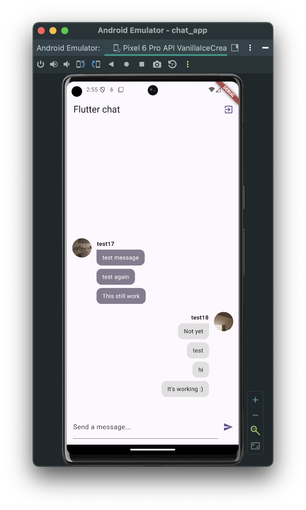
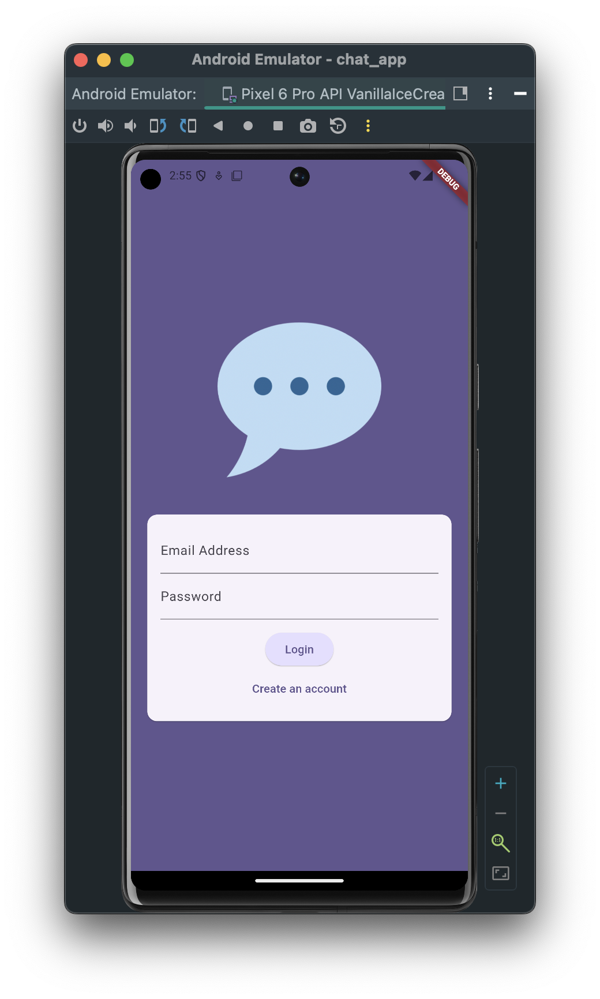
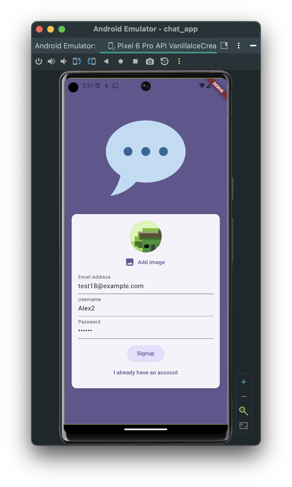
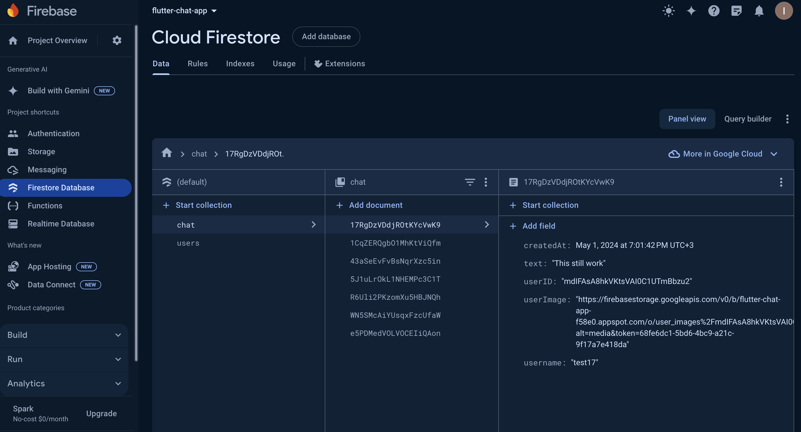
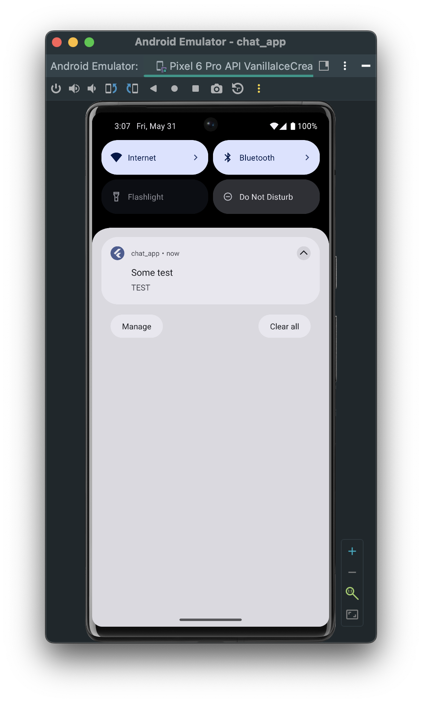

# Chat app
The application was developed on a course https://www.udemy.com/course/learn-flutter-dart-to-build-ios-android-apps/

A simple messaging app.  Each user has a separate nickname and photo. Login to the application is done with email and password.

 

The project utilizes features such as authentication, device camera, data and message storage on the backend, and notifications of new messages. The backend is based on Firebase.

